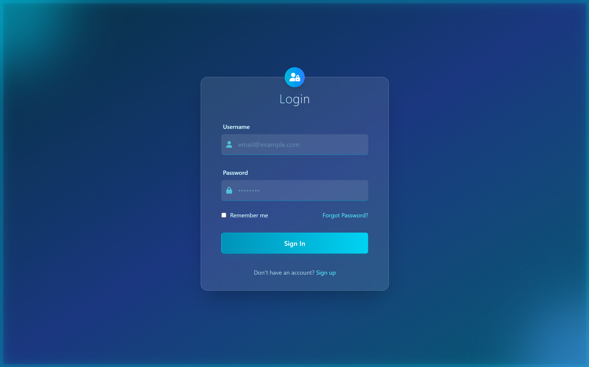

# Tailwind CSS Login Page

A modern, responsive login page built with Tailwind CSS, based on design by Claude Saunet.

## Preview



## Features

- Clean, modern login interface
- Fully responsive design
- Built with Tailwind CSS utility classes
- Customizable components
- Dark/Light mode support

## Technologies Used

- HTML5
- Tailwind CSS
- JavaScript (optional)
- Node.js & npm

## Prerequisites

Before you begin, ensure you have the following installed:

- [Node.js](https://nodejs.org/) (v14.x or higher)
- npm (comes with Node.js) or [Yarn](https://yarnpkg.com/)

## Installation

1. Clone the repository

   ```bash
   git clone https://github.com/yourusername/tailwind-login-page.git
   cd tailwind-login-page
   ```

2. Install dependencies
   ```bash
   npm install
   # or with Yarn
   yarn install
   ```

## Development

To run the development server with hot reloading:

```bash
npm run watch
# or with Yarn
yarn watch
```

The site will be available at `http://localhost:3000` (or another port if 3000 is in use).

## Building for Production

To create a production build:

```bash
npm run build
# or with Yarn
yarn build
```

This will generate optimized files in the `dist` or `build` directory.

## Customization

You can customize the login page by modifying:

- `input.css` - For theme customization visit [Tailwind CSS](https://tailwindcss.com/docs/installation/tailwind-cli)
- HTML files - To change the structure
- CSS files - To add custom styles beyond Tailwind

## License

MIT License

## Credits

Design inspired by Claude Saunet.
